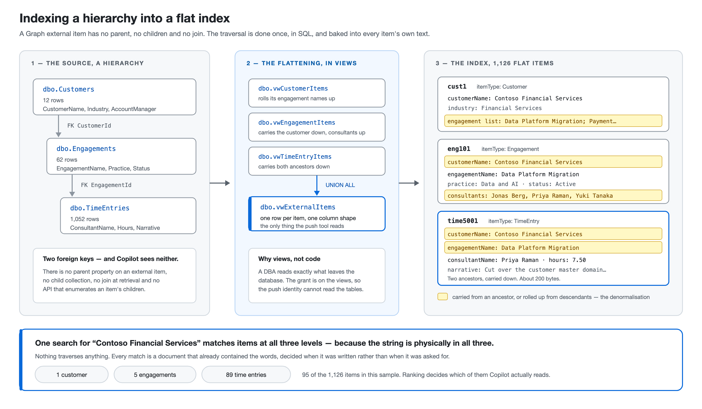

# The three level test case — Customer → Engagement → TimeEntry

A second, independent test case that indexes a **hierarchy** rather than a flat
table, pushed directly to Microsoft Graph with no connector agent involved.

| Level | Table | What it is |
|---|---|---|
| 1 | `dbo.Customers` | Who is billed — the account |
| 2 | `dbo.Engagements` | A contracted body of work for that customer |
| 3 | `dbo.TimeEntries` | One consultant's logged hours against an engagement |

**It coexists with the ticket test case.** Different tables, a different
connection ID, a different schema and a different executable. `SqlGraphPush` and
`dbo.Tickets` are untouched; run both against one tenant if you want to.

The requirement it exists to demonstrate: **a search for a customer in Copilot
must return that customer's engagements and time entries too.**



**To deploy it**, follow [`HIERARCHY-DEPLOYMENT.md`](HIERARCHY-DEPLOYMENT.md).
This document is the design behind it.

---

## The problem, stated honestly

A Graph external item is **flat**. There is no parent property, no child
collection, no join at retrieval time. Copilot fetches individual items; it does
not traverse anything. There is no list-items API to walk, and `externalItem`
documents no relationship of any kind.

So the requirement cannot be met by relating the data. Relationships in SQL
Server are invisible to the index. A time entry item that does not physically
contain the words *Contoso Financial Services* will never be returned by a
search for Contoso, however carefully the foreign keys are declared.

## The answer: denormalise deliberately, in both directions

**Downward.** Every engagement item carries its customer's name, code, industry
and account manager. Every time entry item carries all of that **plus** its
engagement's name, code, practice and status. A search for the customer matches
all three levels because the string is physically present in each of them.

**Upward.** The customer item lists its engagement names. The engagement item
lists the consultants who logged time to it. So a search for an engagement name
returns the customer, and a search for a person returns the engagements they
worked on — not just their own time entries.

The traversal the index will not do is pre-computed, at both ends, in
[`sql/12-timesheet-views.sql`](../sql/12-timesheet-views.sql).

The cost is duplication, and it is the right trade here. These are index items,
not a system of record: `dbo.Customers` remains the only place a customer name is
authored. Rename a customer, push again, and every descendant item is rewritten.

---

## What is in the repository

| File | What it does |
|---|---|
| [`sql/10-timesheet-source.sql`](../sql/10-timesheet-source.sql) | The three tables, foreign keys, indexes, `IsDeleted` and `LastModified` |
| [`sql/11-timesheet-sample-data.sql`](../sql/11-timesheet-sample-data.sql) | 12 customers, 62 engagements, 1052 time entries |
| [`sql/12-timesheet-views.sql`](../sql/12-timesheet-views.sql) | **The flattening layer.** Three views plus `dbo.vwExternalItems` |
| [`sql/13-timesheet-least-privilege.sql`](../sql/13-timesheet-least-privilege.sql) | `SELECT` on the views only, with the base tables explicitly denied |
| [`src/SqlHierarchyPush/`](../src/SqlHierarchyPush) | The push tool: schema registration and one `PUT` per row |
| [`deploy/Test-HierarchySearch.ps1`](../deploy/Test-HierarchySearch.ps1) | Proves the requirement against the live index |
| [`docs/hierarchy-in-copilot.pptx`](hierarchy-in-copilot.pptx) | The same argument as a deck, for explaining it to someone else |

Sample data is sized so the demonstration means something: every customer has
four to six engagements, every engagement twelve to twenty-two time entries. A
search returning three items proves nothing about ranking or spread.

**1126 items in total**, which counts against tenant item quota — worth knowing
before pushing this into a production tenant.

---

## The schema, and why each property is annotated as it is

One flat schema serves all three levels. A time entry populates the engagement
and customer columns; a customer leaves the descendant columns unset. That is
what "flat" costs, and it is cheaper than three connections — which could not be
searched as one thing.

Two platform rules shape every line of it:

- **`isSearchable` and `isRefinable` are mutually exclusive.** Anything a person
  *types* is searchable; anything they *filter or facet by* is refinable. The
  tool throws before the first Graph call if that is ever violated, because
  otherwise you find out fifteen minutes into schema registration, with a
  connection stuck in `draft` that cannot be corrected without deleting it.
- **Property names are at most 32 alphanumeric characters.**

| Property | Type | Annotations | Why |
|---|---|---|---|
| `itemType` | String | queryable, retrievable, **refinable** | You facet by level, you do not type it |
| `title` | String | **searchable**, queryable, retrievable, label `title` | |
| `url` | String | retrievable, label `url` | |
| `lastModified` | DateTime | queryable, retrievable, label `lastModifiedDateTime` | |
| `containerName` | String | **searchable**, queryable, retrievable, label `containerName` | The engagement a time entry sits in; the customer an engagement sits in |
| `containerUrl` | String | retrievable, label `containerUrl` | |
| `hierarchyPath` | String | **searchable**, queryable, retrievable | The whole breadcrumb as one string, so a query naming two levels at once matches |
| `customerName` | String | **searchable**, queryable, retrievable | **On all three levels.** This is the requirement |
| `customerCode` | String | **searchable**, queryable, retrievable | People search `CONT` as readily as the full name |
| `accountManager` | String | **searchable**, queryable, retrievable | |
| `industry` | String | queryable, retrievable, **refinable** | A filter, not a search term |
| `region` | String | queryable, retrievable, **refinable** | |
| `engagementName` | String | **searchable**, queryable, retrievable | On engagements *and* time entries |
| `engagementCode` | String | **searchable**, queryable, retrievable | |
| `projectManager` | String | **searchable**, queryable, retrievable | |
| `practice` | String | queryable, retrievable, **refinable** | |
| `status` | String | queryable, retrievable, **refinable** | |
| `consultantName` | String | **searchable**, queryable, retrievable | |
| `consultantEmail` | String | queryable, retrievable | Looked up, not searched |
| `workType` | String | queryable, retrievable, **refinable** | |
| `workDate` | DateTime | queryable, retrievable | |
| `hours` | Double | queryable, retrievable | |
| `billable` | Boolean | queryable, retrievable | |
| `contractValue` | Double | queryable, retrievable | |
| `totalHours` | Double | queryable, retrievable | Rolled up, so an answer can cite a number without adding items up |
| `childCount` | Int64 | queryable, retrievable | |

**`containerName` deserves the attention.** It is a semantic label meaning "the
thing this item sits inside" — the closest a flat index gets to a hierarchy, and
result surfaces show it as the item's context. An engagement's container is its
customer; a time entry's names both ancestors, because one level is not enough
context in a result list.

**The content**, separate from the properties, is where most of the searchable
text actually lives: the consultant's narrative, preceded by the customer and
engagement header lines the view builds. That header is what makes a customer
search reach a time entry.

---

## Running it

### 1. The database

```sql
-- against the same database as the ticket test case, or its own
:r sql/10-timesheet-source.sql
:r sql/11-timesheet-sample-data.sql
:r sql/12-timesheet-views.sql
:r sql/13-timesheet-least-privilege.sql   -- edit the principal name first
```

`12-timesheet-views.sql` ends with four verification queries. **Query 3 is the
requirement, asked in SQL**, before Graph is involved at all:

```sql
SELECT ItemType, COUNT(*) FROM dbo.vwExternalItems
WHERE Content LIKE N'%Contoso Financial Services%' GROUP BY ItemType;
```

Three rows back — `Customer`, `Engagement`, `TimeEntry` — and the flattening
works. One row back, and no amount of Graph configuration will save it.

### 2. Configure and push

`src/SqlHierarchyPush/appsettings.json` has the same shape as the connector's,
plus `Graph` and `Source` sections. Note `Auth:CertificateStoreLocation` is
`CurrentUser`: this runs as a person.

Check everything before spending fifteen minutes on schema registration:

```powershell
.\deploy\Test-GraphPushPrereqs.ps1 -ConfigPath ..\src\SqlHierarchyPush\appsettings.json
```

Then read the source and report what *would* be written, with no tenant involved:

```powershell
dotnet run --project src\SqlHierarchyPush -- --dry-run
```

Then, for real:

```powershell
dotnet run --project src\SqlHierarchyPush
```

Schema registration takes 5 to 15 minutes. Watch it, and **read the schema it
prints** — after this it is append-only, and correcting a mistake means deleting
the connection and every item in it:

```powershell
.\deploy\Watch-SchemaRegistration.ps1 -ConfigPath ..\src\SqlHierarchyPush\appsettings.json
```

### 3. Prove it

```powershell
.\deploy\Test-HierarchySearch.ps1
```

Run as a person in the ACL group — search is security trimmed and `/search/query`
has no app-only form, so what a *user* can find is the only meaningful question.
It checks that the schema's searchable annotations are right, then searches one
customer name and groups the hits by level. All three levels must appear.

---

## Prompts worth asking Copilot

Once items are in the semantic index — allow longer than search, they are built
independently from the same content — these exercise the flattening rather than
just retrieval:

- *What work have we done for Contoso Financial Services?* — should cite the
  customer item **and** engagement items.
- *Who has logged time against the Data Platform Migration?* — engagement item
  plus time entries; the consultant list is rolled into the engagement content.
- *What is Priya Raman working on?* — time entries **and** the engagements she
  appears on, which is the upward roll up doing its job.
- *Summarise the Northwind Health engagements and their status.* — several
  engagement items for one customer.
- *Which customers are in the Financial Services industry?* — `industry` is
  refinable and retrievable.
- *What did we find during the payment gateway resilience review?* — narrative
  text from time entries under one engagement.

A weak answer to the first two usually means semantic indexing has not caught up
yet, not that the flattening failed. Prove that distinction with
`Test-HierarchySearch.ps1`: if search returns all three levels and Copilot does
not, the pipeline is fine and the semantic index is behind.

---

## What this test case deliberately does not do

**It does not delete.** Like every direct push, `SqlHierarchyPush` excludes
soft-deleted rows from the push rather than removing their items — so a deleted
time entry stays indexed and citable. Eight rows in the sample data are soft
deleted on purpose so this is demonstrable rather than theoretical:

```powershell
.\deploy\Compare-SourceToIndex.ps1 -ConfigPath ..\src\SqlHierarchyPush\appsettings.json
```

They show as `ORPHAN`, with the `DELETE` for each one printed and not run. See
[`TROUBLESHOOTING-DIRECT-PUSH.md`](TROUBLESHOOTING-DIRECT-PUSH.md#the-deletion-problem).

**It does not crawl incrementally**, and nothing runs it on a schedule. Every
run reads and re-writes all 1126 items. The `LastModified` columns exist so this
source could move behind the agent-hosted connector later without a migration,
not because this tool uses them.

**It does not make the index hierarchical.** Nothing here changes the fact that
external items are flat. What it does is make the hierarchy *visible in the
text*, which is the only mechanism the platform offers.

**It does not aggregate at query time.** `totalHours` and `childCount` are
computed in SQL at push time and are correct as of the last push. Copilot will
not add up a thousand time entries reliably; giving it the number is better than
hoping.

---

## Differences from the ticket test case

| | `SqlGraphPush` (tickets) | `SqlHierarchyPush` (this) |
|---|---|---|
| Source | One table, `dbo.Tickets` | Three tables, through four views |
| Items | One per ticket | One per customer, engagement and time entry |
| Schema | 6 properties | 26 properties |
| Connection ID | `sqltickets` | `consultingwork` |
| Engine | `SqlPushCore`, the same one | `SqlPushCore`, the same one |
| Throttling, dry run, exit codes | The engine's | The engine's, identical |

Both accept a **certificate or a client secret** through `Auth:Mode`, using the
same shared credential code as the agent-hosted connector. Certificate is the
default; the client secret path keeps the value in Windows Credential Manager
with only the entry's name in configuration, and is set up in
[`HIERARCHY-DEPLOYMENT.md`](HIERARCHY-DEPLOYMENT.md#step-3b--using-a-client-secret-instead-of-a-certificate).

**The connection IDs must differ.** `OwnedBy` means whichever app created a
connection is the only one that can manage it, the two register different
schemas, and a registered schema cannot be changed. The engine enforces this
without either connector naming the other: before pushing, it compares the
schema registered on the connection against the one this connector builds, and
any foreign property fails the run with that property named. A guard list of
other connectors' IDs would go stale the day a connector is added; the schema
comparison cannot.

Everything security-related is shared, not duplicated:
`SqlConnector.Security` resolves the certificate, builds the credential,
constructs the SQL connection and scrubs the logs for both tools. Only the schema
and the item shape are new. The agent-hosted connector still has no Graph
dependency of any kind.
